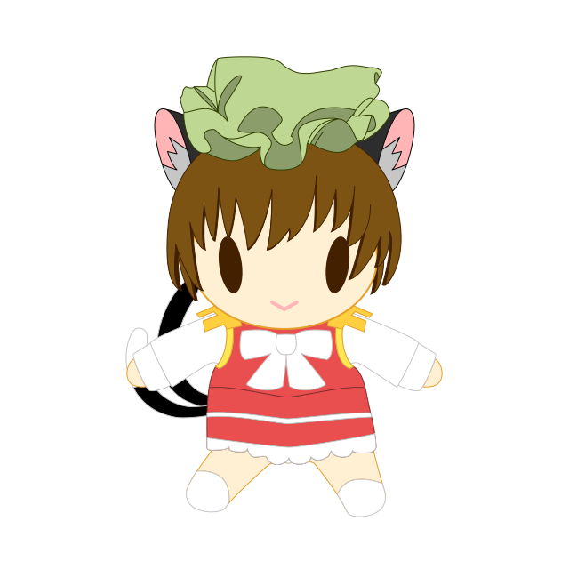
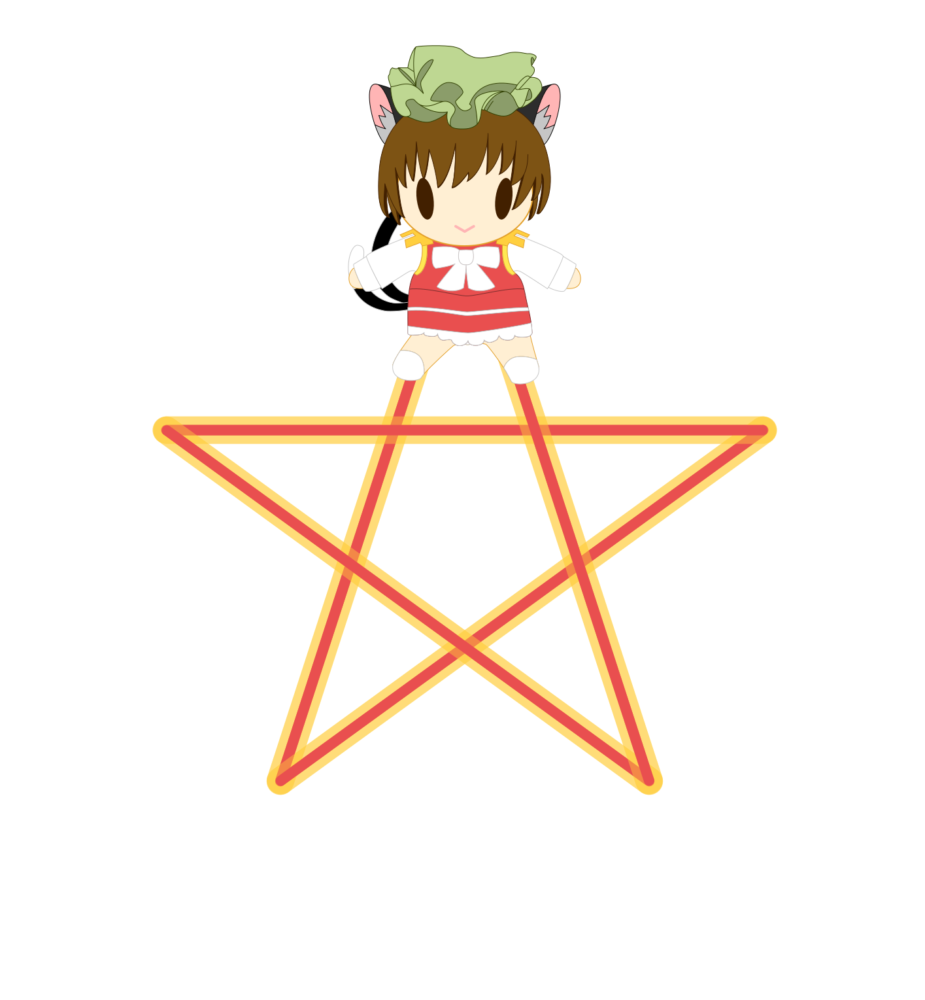
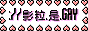
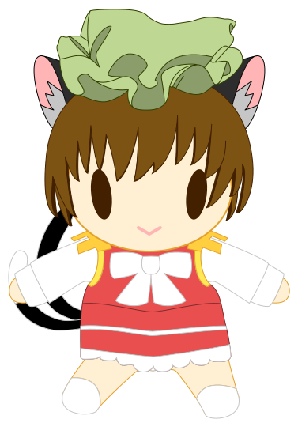

  
  
  
  

<table align="right">
  <tr>
    <td align="center" valign="middle">
      
      
      
      
      
      
      
      
      
      
      
      
    </td>
    <td align="middle" valign="middle">
      
       
       
      
    </td>
  </tr>
  <tr>
    <td align="center" valign="middle">
      
    </td>
    <td align="left" valign="middle">
      
       
      
    </td>
  </tr>
  <tr>
    <td align="center" valign="middle">
       
      &nbsp;&nbsp;  
      &nbsp;&nbsp;&nbsp;&nbsp;
        
      
    </td>
    <td align="right" valign="middle">
      
      &nbsp;
      
      &nbsp;
      
      &nbsp;
      
      &nbsp;
      
      &nbsp;
      
      &nbsp;
      
      &nbsp;
      
      &nbsp;
    </td>
  </tr>
</table>

  
  &nbsp;&nbsp;&nbsp;&nbsp;&nbsp;&nbsp;&nbsp;&nbsp;
  

